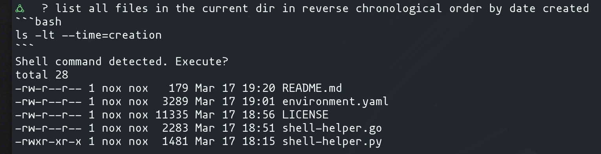

#  Shell Helper

Don't remember obscure shell commands?

No problem: Just type `? do the thing` and let your LLM frens take care of it.



## Installation instructions

```bash
alias ?='shell_helper.py $@'
```

Your openai API key goes in ~/.config/shell-helper/key

```bash
mkdir -p ~/.config/shell-helper
touch ~/.config/shell-helper/key
```

